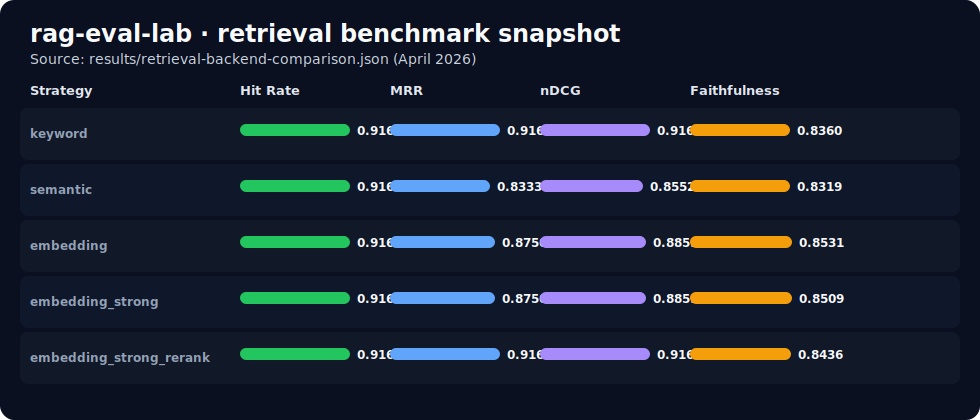

# rag-eval-lab

A framework for evaluating retrieval-augmented QA systems using citation support, retrieval relevance, and answer faithfulness on public document corpora.

## Overview

`rag-eval-lab` is a narrow, professional v1 scaffold for experimenting with grounded question answering over public documents. The initial focus is not a polished chat UI. It is a reproducible evaluation loop:

- load public documents
- split them into chunks
- retrieve relevant evidence with keyword or vector-space retrieval
- generate a grounded answer with citations
- score retrieval, citation support, and answer quality
- produce a benchmark artifact

This repository is intentionally scoped to public or synthetic data to avoid employer IP overlap.

## Benchmark Snapshot

Latest benchmark comparison snapshot (visual + table):



| Strategy | Hit Rate | MRR | nDCG | Faithfulness |
| --- | ---: | ---: | ---: | ---: |
| `keyword` | 0.9167 | 0.9167 | 0.9167 | 0.8360 |
| `semantic` | 0.9167 | 0.8333 | 0.8552 | 0.8319 |
| `embedding` | 0.9167 | 0.8750 | 0.8859 | 0.8531 |
| `embedding_strong` | 0.9167 | 0.8750 | 0.8859 | 0.8509 |
| `embedding_strong_rerank` | 0.9167 | 0.9167 | 0.9167 | 0.8436 |

## V1 Scope

The first version is designed around one document family and a small benchmark set.

- Public documents only
- Local document ingestion from `data/raw/`
- Chunking with heading-aware paragraph merging
- Keyword baseline plus semantic TF-IDF, embedding, and reranked retrieval
- Grounded QA response schema with explicit citations and support checks
- Retrieval relevance, hit-rate, MRR, nDCG, citation support, and faithfulness metrics
- JSON benchmark report output in `results/`

## Architecture

```text
rag-eval-lab/
├── app/
│   ├── api/
│   ├── evaluation/
│   ├── retrieval/
│   ├── schemas/
│   └── services/
├── data/
│   ├── raw/
│   └── processed/
├── notebooks/
├── results/
├── scripts/
├── tests/
├── README.md
├── requirements.txt
└── main.py
```

## Example Workflow

1. Add one or more `.txt` documents under `data/raw/`.
2. Start the API.
3. Ask a grounded question against the local corpus.
4. Run the benchmark script to generate a report.
5. Run the comparison script to compare retrieval strategies.

## Metrics Used

- `retrieval_relevance_at_k`: fraction of retrieved chunks that overlap with expected keywords
- `retrieval_hit_rate_at_k`: whether the benchmark retrieved the intended chunk ids for a case
- `retrieval_mrr`: reciprocal-rank score for the first correct chunk
- `retrieval_ndcg`: rank-sensitive gain for the full retrieved list
- `citation_support`: fraction of answer claims whose cited chunk passes a support threshold
- `answer_faithfulness`: lexical overlap between answer content and retrieved context

The current implementation includes keyword retrieval, a local TF-IDF vector space baseline, two embedding backends powered by `fastembed`, and a late-interaction rerank stage on top of strong embedding retrieval. On first use, the embedding and rerank backends download their model weights into the local cache.

## How To Run

```bash
python -m venv .venv
source .venv/bin/activate
pip install -r requirements.txt
uvicorn main:app --reload
```

Run the benchmark script:

```bash
python scripts/run_benchmark.py
```

Run the comparison script:

```bash
python scripts/compare_benchmarks.py
```

Render a markdown benchmark report:

```bash
python scripts/render_benchmark_report.py
```

## API Endpoints

- `GET /` (tiny demo UI)
- `GET /health`
- `POST /qa/query`
- `POST /qa/benchmark`

## Tiny Demo UI

After starting the API server, open:

```text
http://127.0.0.1:8000/
```

The page provides a lightweight one-screen flow to:

- enter a question
- choose retrieval strategy
- run grounded answer generation
- inspect returned citations and unsupported claims

## Example Benchmark Output

The benchmark script writes a JSON report similar to:

```json
{
  "run_id": "semantic-tfidf-retrieval",
  "question_count": 2,
  "average_retrieval_relevance": 0.5,
  "average_retrieval_hit_rate": 0.67,
  "average_citation_support": 1.0,
  "average_answer_faithfulness": 0.89
}
```

The comparison script writes a second artifact like:

```json
{
  "comparison_id": "retrieval-backend-comparison",
  "strategies": [
    {
      "run_id": "baseline-keyword-retrieval",
      "retrieval_strategy": "keyword"
    },
    {
      "run_id": "semantic-tfidf-retrieval",
      "retrieval_strategy": "semantic"
    },
    {
      "run_id": "embedding-retrieval",
      "retrieval_strategy": "embedding"
    },
    {
      "run_id": "embedding-strong-retrieval",
      "retrieval_strategy": "embedding_strong"
    },
    {
      "run_id": "embedding-strong-rerank-retrieval",
      "retrieval_strategy": "embedding_strong_rerank"
    }
  ],
  "metric_deltas": {
    "semantic_tfidf_retrieval_relevance_delta": 0.0,
    "embedding_retrieval_mrr_delta": -0.0417,
    "embedding_strong_retrieval_mrr_delta": -0.0417,
    "embedding_strong_rerank_retrieval_mrr_delta": 0.0
  }
}
```

## Benchmark Snapshot Details

Current comparison summary from `results/retrieval-backend-comparison.json` and rendered markdown report in `results/benchmark-report.md`:

| Strategy | Hit Rate | MRR | nDCG | Faithfulness |
| --- | ---: | ---: | ---: | ---: |
| `keyword` | 0.9167 | 0.9167 | 0.9167 | 0.8360 |
| `semantic` | 0.9167 | 0.8333 | 0.8552 | 0.8319 |
| `embedding` | 0.9167 | 0.8750 | 0.8859 | 0.8531 |
| `embedding_strong` | 0.9167 | 0.8750 | 0.8859 | 0.8509 |
| `embedding_strong_rerank` | 0.9167 | 0.9167 | 0.9167 | 0.8436 |

## Result Interpretation

- `keyword` is a strong baseline on this public-document benchmark and remains hard to beat on rank-sensitive retrieval metrics.
- Dense retrieval alone improves answer faithfulness slightly, but both embedding backends still trail the lexical baseline on `MRR` and `nDCG`.
- Adding a late-interaction reranker closes that ranking gap and matches the lexical baseline on `MRR` and `nDCG` without changing the benchmark corpus.

## Example Cases

1. Timeline prioritization:
   `embedding` and `embedding_strong` rank `incident_response_playbook-chunk-4` ahead of the correct rollback chunk for the question "What should take priority over writing the full incident timeline?", which drops `MRR` to `0.5`. The reranked pipeline restores `incident_response_playbook-chunk-2` to rank 1.

2. Security disclosure:
   For "How should someone disclose a security flaw before a fix is ready?", dense retrieval pulls in `opensource_maintainer_guide-chunk-3` as a near-miss issue-triage chunk. The reranked pipeline restores the stronger ordering led by `opensource_maintainer_guide-chunk-1`.

## Public Data Suggestions

- university policy manuals
- open-source product documentation exported to text
- government guidance documents
- public company policy documents

The starter corpus now mixes university policy text, an open-source maintainer guide, a public operations manual, and an incident response playbook so lexical and semantic retrieval can be compared against distractor chunks, paraphrased questions, synonym-heavy prompts, and unanswerable cases.

## Limitations

- Strong embedding retrieval alone does not yet beat the lexical baseline on this benchmark
- The reranked pipeline matches the lexical baseline on rank-sensitive retrieval metrics, which suggests ranking quality was the main weakness in the dense-only variants
- Document parsing is text-first and does not yet handle PDFs directly
- Citation support and faithfulness scoring are heuristic and should be replaced with stronger evaluators
- No experiment tracking database yet

## Roadmap

- add PDF ingestion and metadata extraction
- add model-backed embedding retrieval backend
- compare chunking strategies
- add richer faithfulness and hallucination checks
- generate markdown and HTML benchmark reports
